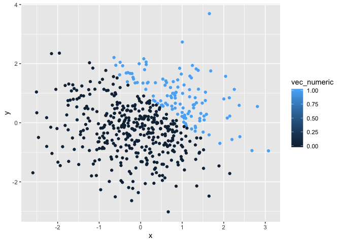

Homework 1
================
Sophia Miller
9/19/2019

# Loading tidyverse:

``` r
library(tidyverse)
```

    ## ── Attaching packages ─────────────────────────────────────────────────────── tidyverse 1.2.1 ──

    ## ✔ ggplot2 3.2.1     ✔ purrr   0.3.2
    ## ✔ tibble  2.1.3     ✔ dplyr   0.8.3
    ## ✔ tidyr   0.8.3     ✔ stringr 1.4.0
    ## ✔ readr   1.3.1     ✔ forcats 0.4.0

    ## ── Conflicts ────────────────────────────────────────────────────────── tidyverse_conflicts() ──
    ## ✖ dplyr::filter() masks stats::filter()
    ## ✖ dplyr::lag()    masks stats::lag()

# Problem 1

## Creating a data frame comprised of:

  - a random sample of size 8 from a standard Normal distribution
  - a logical vector indicating whether elements of the sample are
    greater than 0
  - a character vector of length 8
  - a factor vector of length 8, with 3 different factor “levels”

<!-- end list -->

``` r
problem1_df = tibble(
  norm_samp = rnorm(8),
  norm_samp_pos = norm_samp > 0,
  vec_char = c("This", "is", "the", "first", "data", "science", "homework", "assignment"),
  vec_factor = factor(c("one", "two", "three", "one", "two", "three", "one", "two"))
)
```

# Taking the mean of each variable in the above data frame

``` r
mean(pull(problem1_df, norm_samp))
```

    ## [1] 0.2660184

``` r
mean(pull(problem1_df, norm_samp_pos))
```

    ## [1] 0.625

``` r
mean(pull(problem1_df, vec_char))
```

    ## Warning in mean.default(pull(problem1_df, vec_char)): argument is not
    ## numeric or logical: returning NA

    ## [1] NA

``` r
mean(pull(problem1_df, vec_factor))
```

    ## Warning in mean.default(pull(problem1_df, vec_factor)): argument is not
    ## numeric or logical: returning NA

    ## [1] NA

*We are able only able to take the mean of the numeric and logical
variables. We are unable to take the mean of the character and factor
variables.*

## Converting the logical, character, and factor variables to numeric:

``` r
as.numeric(pull(problem1_df, norm_samp_pos))
```

    ## [1] 1 1 0 1 1 1 0 0

``` r
as.numeric(pull(problem1_df, vec_char))
```

    ## Warning: NAs introduced by coercion

    ## [1] NA NA NA NA NA NA NA NA

``` r
as.numeric(pull(problem1_df, vec_factor))
```

    ## [1] 1 3 2 1 3 2 1 3

*After applying the as.numeric function, the logical vector is assigned
values of 1 and 0, which indicate whether or not an element of the
sample is greater than 0. The factor vector is assigned values of 1, 2
and 3, indicating which of the three factor levels an element belongs
to. Now that these variables are assigned numeric values, we are able to
take the mean.*

## The code chunk below does the following:

  - converts the logical vector to numeric, and multiplies the random
    sample by the result
  - converts the logical vector to a factor, and multiplies the random
    sample by the result
  - converts the logical vector to a factor and then converts the result
    to numeric, and multiplies the random sample by the result

<!-- end list -->

``` r
log_num = as.numeric(pull(problem1_df, norm_samp_pos))

log_num * (pull(problem1_df, norm_samp))
```

    ## [1] 0.6191016 1.3196591 0.0000000 1.0973462 0.1051538 0.5754707 0.0000000
    ## [8] 0.0000000

``` r
log_fac = as.factor(pull(problem1_df, norm_samp_pos))

log_fac * (pull(problem1_df, norm_samp))
```

    ## Warning in Ops.factor(log_fac, (pull(problem1_df, norm_samp))): '*' not
    ## meaningful for factors

    ## [1] NA NA NA NA NA NA NA NA

``` r
log_fac_num = as.numeric(as.factor(pull(problem1_df, norm_samp_pos)))

log_fac_num * (pull(problem1_df, norm_samp))
```

    ## [1]  1.23820315  2.63931816 -0.07847277  2.19469245  0.21030761  1.15094141
    ## [7] -0.40434204 -1.10576938

\<\<\<\<\<\<\< HEAD \# Problem 2

## Creating a data frame comprised of :

  - x: a random sample of size 500 from a standard normal distribution
  - y: a random sample of size 500 from a standard normal distribution
  - a logical vector indicating whether x + y \>1
  - a numeric vector created by coercing the above logical vector
  - a factor vector created by coercing the above logical vector

<!-- end list -->

``` r
problem2_df = tibble(
  x = rnorm(500),
  y = rnorm(500),
  vec_logical = x + y > 1,
  vec_numeric = as.numeric(vec_logical),
  vec_factor = as.factor(vec_logical),
)
```

## Making a scatterplot of y vs. x; color points using logical variable

``` r
ggplot(problem2_df, aes(x = x, y = y, color = vec_logical)) + geom_point()
```

<!-- -->
